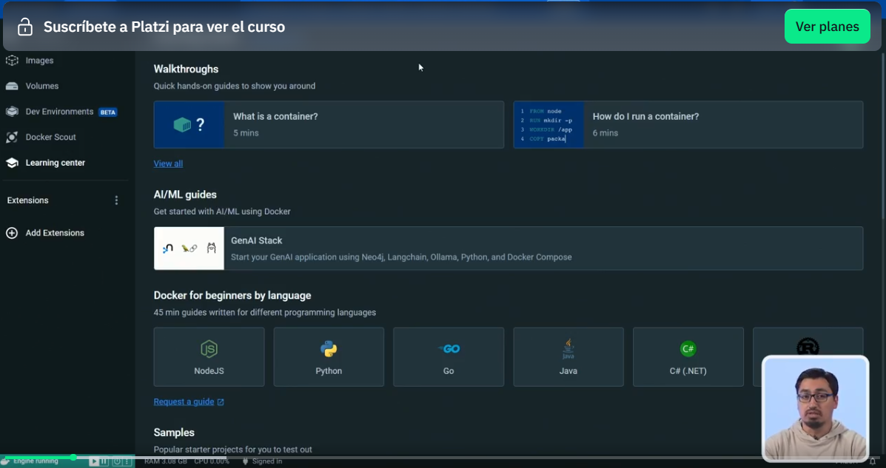
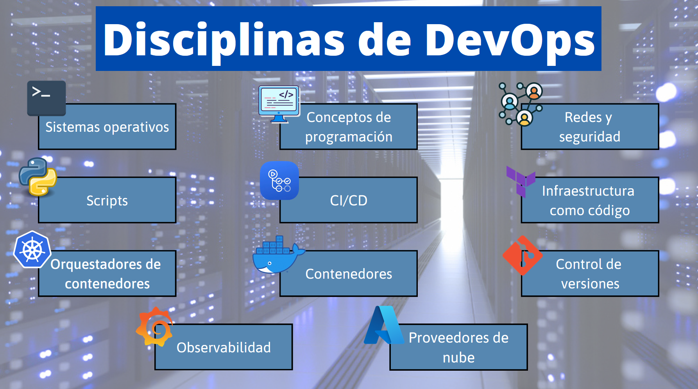
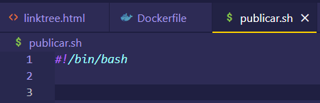
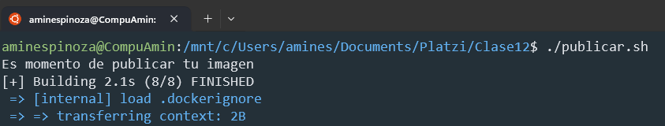
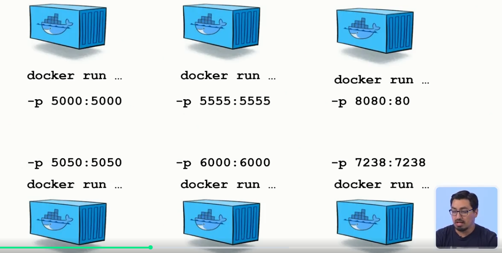
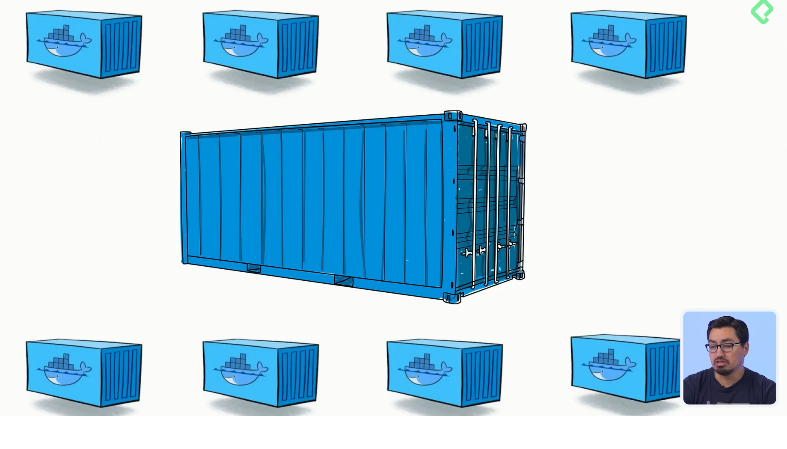
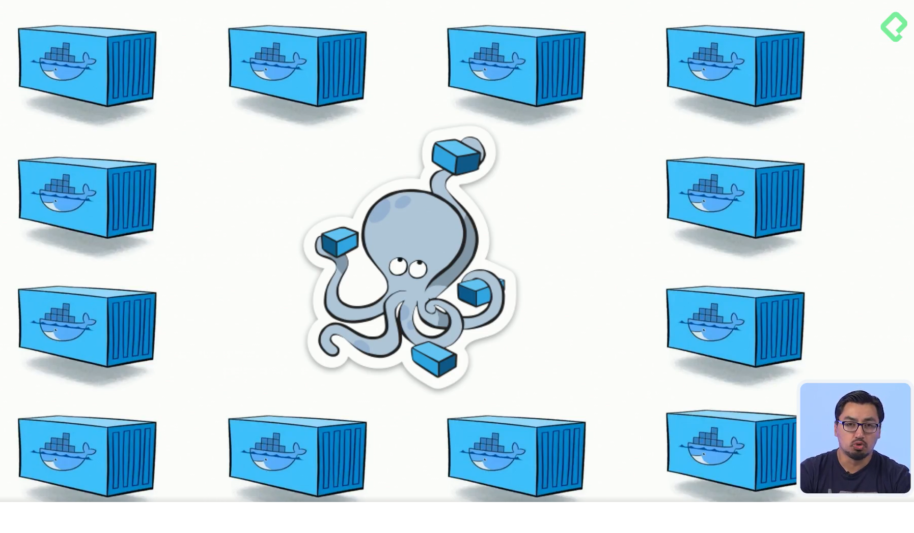

# Fundamentos

## Configuración e inicio:
- Instalar segun SO
### Exploración de Docker Desktop:

¿Cómo navegar por la interfaz de Docker Desktop?
Docker Desktop es una herramienta fundamental para los desarrolladores que desean optimizar sus procesos de desarrollo y despliegue de aplicaciones. Al abrir Docker Desktop, te encontrarás con una pantalla que puede parecer abrumadora al principio, pero conocer su estructura te permite aprovechar al máximo esta potente herramienta.

¿Qué es el Learning Center?
El Learning Center es una de las secciones más valiosas de Docker Desktop. Aquí puedes encontrar información y consejos útiles sobre cómo trabajar con diferentes lenguajes de programación en Docker. Las categorías más utilizadas están fácilmente accesibles, proporcionando guías y ejemplos para comenzar a experimentar con Docker. Sin embargo, no se limita solo a los lenguajes más populares, ya que puedes explorar una variedad más amplia de herramientas compatibles.

¿Cuáles son las secciones clave de Docker Desktop?
Contenedores: Esta es una de las áreas que más utilizarás. A medida que avances en tu aprendizaje y desarrollo, irás llenando esta sección con múltiples contenedores creados para tus proyectos.

Imágenes: Posee tres categorías principales:

Local: Imágenes almacenadas en tu máquina.
Remota: Imágenes disponibles en Docker Hub.
Artefactos: Incluye opciones como “Early Access” que merecen consideración antes de uso extensivo.
Docker Scout: Una herramienta que te permite analizar cómo se están desplegando tus imágenes, incluso antes de ser creadas como contenedores.

Ambientes de Desarrollo o Dev Environments: Aunque está en fase beta, se destaca por su capacidad para uniformizar las herramientas utilizadas por los desarrolladores, asegurando la coherencia en el uso de versiones de programas y configuraciones.

Volúmenes: Funcionan como unidades de almacenamiento externo que tus contenedores y sistema operativo pueden utilizar. Son especialmente útiles para compartir recursos, como archivos de video, entre el sistema operativo anfitrión y los contenedores Docker.

¿Cómo configurar y utilizar Docker Desktop?
En la parte superior derecha de Docker Desktop, encontrarás un engranaje que te lleva a la configuración. Aquí puedes ajustar desde elementos estéticos, como el tema de color, hasta configuraciones más avanzadas.

Integración con WSL (Windows Subsystem for Linux): En Windows, es crucial habilitar la opción de usar WSL para crear una comunicación efectiva entre Docker y tus contenedores.

Actualizaciones: Docker Desktop se actualiza automáticamente, lo cual es vital para estar al tanto de las últimas características y mejoras. Asegúrate de que esta opción esté habilitada para evitar lapsos en las actualizaciones.

En resumen, aunque Docker Desktop cuenta con una interfaz gráfica completa, es importante recordar que la línea de comandos sigue siendo un componente esencial. La interfaz permite ejecutar comandos equivalentes con clics, pero dominar ambas formas enriquecerá tu experiencia como desarrollador. ¡Sigue explorando y experimentando para dominar Docker Desktop por completo!

### Linea de comandos:

¿Cómo interactuar con Docker desde la línea de comandos?
Docker es una herramienta poderosa para gestionar contenedores, y puede ser utilizada tanto desde una interfaz gráfica como desde la línea de comandos. Dominando la línea de comandos, no solo tienes un control más detallado sobre las tareas, sino que también puedes automatizar procesos y trabajar eficientemente en entornos sin interfaz gráfica. Exploremos algunas de las funcionalidades básicas para manejar Docker desde la terminal.

¿Cómo verificar la instalación de Docker?
Lo primero que debes hacer una vez instalado Docker es asegurarte de que todo está funcionando correctamente. Un comando esencial para esto es:

`docker version`
Este comando te mostrará la versión de Docker instalada y confirmará que la línea de comandos tiene acceso al motor de Docker.

¿Qué información proporciona docker info?
Para obtener una visión más detallada del entorno en el que Docker opera, puedes usar:

`docker info`
Este comando te dará detalles sobre el hardware que Docker está utilizando, como la memoria, el procesador y posibles configuraciones de la GPU. Esta información es crucial si estás considerando optimizar los recursos de hardware para un mejor rendimiento.

¿Cómo gestionar imágenes y contenedores?
Docker organiza todo en imágenes y contenedores, y es vital entender cómo gestionar estos elementos desde la línea de comandos para un manejo eficiente.

¿Cómo listar tus imágenes?
Para ver todas las imágenes disponibles en tu entorno local, el comando a utilizar es:

`docker images`
Este listado es análogo al que verías en la sección de imágenes de Docker Desktop, y es una herramienta esencial para mantener un seguimiento de las imágenes que tienes disponibles.

¿Cómo ver los contenedores activos?
Para controlar y ver todos los contenedores que están activos en tu entorno de Docker, debes usar:

`docker ps`
Este comando te proporciona información sobre los contenedores que están corriendo, similar a lo que verías en la sección de contenedores en Docker Desktop.

¿Cómo obtener ayuda para comandos específicos?
Docker cuenta con una extensa documentación que es fundamental para el aprendizaje y el uso eficiente de sus comandos. Para explorar las opciones de un comando específico, utiliza la opción help.

¿Cómo usar help para comandos?
Si bien Docker no tiene una lista infinita de comandos, cada uno de ellos tiene múltiples parámetros que pueden personalizarse. Por ejemplo:

Para obtener ayuda sobre el comando docker build:
`docker build --help`
Para el comando docker run:
`docker run --help`
Esta función es increíblemente útil para descubrir y entender los diversos parámetros disponibles para cada comando, sin necesidad de memorizar todo.

Recomendaciones para mejorar tu experiencia con Docker
Aquí te ofrecemos algunos consejos prácticos para que puedas sacar el máximo provecho de Docker:

Explora ambas interfaces: Experimenta tanto con la línea de comandos como con Docker Desktop, y decide cuál se adapta mejor a tu estilo de trabajo.
Consulta la documentación regularmente: La documentación es tu mejor aliado para aprender y recordar funciones y parámetros.
Automatiza procesos: Aprende a crear scripts que te permitan automatizar tareas repetitivas usando la línea de comandos.
Recuerda, la práctica constante con Docker y la exploración de sus múltiples funcionalidades te ayudarán a dominar esta herramienta y a convertirte en un experto en la gestión de contenedores. La eficiencia y el conocimiento vienen con el uso continuo y la curiosidad por aprender más. ¡Sigue explorando!

### Configuración del dockerfile
Se realiza en una carpeta llamada Sitio

[Enlace del repositorio con el material de la clase](https://github.com/platzi/curso-de-docker-fundamentos/tree/clase-06)

### Crear una imagen 
¿Cómo construir una imagen de Docker con un Dockerfile?
Crear una imagen de Docker puede parecer un desafío, pero una vez que dominas el proceso, facilita la distribución y despliegue de aplicaciones. La clave está en el Dockerfile, un archivo esencial que define los pasos necesarios para construir una imagen de Docker. A partir de él, puedes crear una imagen que podrás compartir fácilmente. Te explico cómo hacerlo.

¿Qué comandos son útiles para verificar la ubicación del Dockerfile?
Antes de construir una imagen, es fundamental asegurarse de que estás en la ruta correcta en tu terminal, donde se encuentra el Dockerfile. Esto se puede verificar utilizando el comando ls en Linux. Este comando listado te mostrará los archivos en el directorio actual, permitiéndote confirmar la presencia del Dockerfile requerido.

¿Cómo construir realmente la imagen de Docker?
Para comenzar a construir la imagen, utiliza el comando `docker build .` en tu terminal. El punto (.) indica que el Dockerfile se encuentra en la ubicación actual. Al ejecutar el comando, Docker leerá las instrucciones del Dockerfile y comenzará a crear la imagen, mostrando la secuencia de pasos ejecutados. Verás algo como esto:

`docker build .`
Docker mostrará los pasos realizados. Por ejemplo, "1/2" podría señalar que está descargando una imagen base como Nginx, y "2/2" indicará que está copiando archivos a la imagen.

¿Qué hacer con la imagen sin nombre?
Tras crear tu primera imagen, al usar docker images, podrías notar que la imagen aparece sin nombre ni "tag" (etiqueta). Aunque es la forma más rápida de crear una imagen, no es recomendable ya que da lugar a falta de información. Si sucede, considera eliminarla con el comando:

`docker rmi -f <image-ID>`
Esto borrará su imagen de forma permanente. Usa -f (force) por si la imagen tiene dependencias que podrían obstaculizar su eliminación.

¿Cómo etiquetar adecuadamente tu imagen?
Etiquetar una imagen es básico para identificarla fácilmente. Al construir la imagen, usa -t seguido del nombre y la etiqueta:

`docker build -t sitio-web:latest .`
Esto le da un nombre y una etiqueta ("latest" indica la última versión). Así, podrás manejar diferentes versiones de tus imágenes con claridad.

¿Qué implica tener una imagen etiquetada?
Una vez etiquetada correctamente, al listar las imágenes con docker images, tu nueva imagen aparecerá con el nombre y la etiqueta especificados, por ejemplo, "sitio-web:latest". Esto facilita la gestión de varias versiones de una aplicación o servicio.

¿Qué sigue después de crear una imagen de Docker?
Con la creación de la imagen finalizada, ahora puedes proceder al despliegue en diferentes entornos comenzando por tu entorno local. Esto implica la ejecución de contenedores basados en la imagen que acabas de construir. Tener imágenes debidamente etiquetadas simplifica su organización y el reciclaje de versiones anteriores.

Sumérgete en el mundo de Docker y sigue ampliando tus habilidades. Con cada paso que des, estarás mejor preparado para orquestar aplicaciones en contenedores, una habilidad valiosa en el desarrollo de software moderno. ¡Sigue aprendiendo y explotando todo el potencial de Docker!

### Gestionar contenedores
¿Cómo gestionar contenedores en Docker Desktop?
Docker Desktop es una herramienta fundamental que facilita el desarrollo y la prueba de aplicaciones de manera local. A medida que te familiarizas con Docker Desktop, puedes gestionar y ejecutar contenedores con solo unos clics. Una vez que has construido tu imagen, ejecutarla es tan sencillo como presionar el botón de "Play" o "Run".

Dentro del panel de contenedores, puedes ver estadísticas del hardware y detalles sobre cada contenedor en ejecución. Para detener un contenedor, simplemente seleccionas el botón de "Stop". Sin embargo, para tareas más avanzadas, como la automatización en un entorno de producción, es más eficiente utilizar la línea de comandos.

¿Cómo utilizar la línea de comandos para gestionar contenedores?
Trabajar con la línea de comandos ofrece más control y opciones avanzadas al trabajar con contenedores. Una vez que tengas tu imagen lista, puedes usar diferentes comandos para controlar tus contenedores. Aquí te mostramos un ejemplo de cómo hacerlo:

`docker images` # Muestra las imágenes disponibles
`docker ps` # Muestra los contenedores activos
`docker run -it --rm -d -p 8080:80 (-g) --name web sitio_web` 
Descripción de los comandos y parámetros usados:

docker images: Confirma que la imagen necesaria está disponible.
docker ps: Lista los contenedores que están ejecutándose.
docker run: Ejecuta un contenedor basado en la imagen especificada.
-it: Activa el modo interactivo, esencial para obtener logs en tiempo real.
--rm: Elimina automáticamente el contenedor una vez se detiene.
-p 8080:80: Redirige el puerto 8080 del host al puerto 80 del contenedor.
-g web: Asigna un nombre al contenedor para identificarlo fácilmente.
¿Cómo acceder al sistema de archivos del contenedor?
Una característica poderosa de Docker Desktop es la capacidad de navegar dentro del sistema de archivos del contenedor. Por ejemplo, si trabajas con imágenes de Nginx, puedes ingresar y ver la estructura de los archivos que estás utilizando.

Usa la opción "exec" dentro de Docker Desktop para acceder a la consola del contenedor y explorar:

#### Obtener y visualizar la estructura de archivos dentro de un contenedor Nginx
`docker exec -it <nombre_del_contenedor> ls /usr/share/nginx/html`
¿Cómo acceder al sitio web desplegado?
Con tu contenedor ejecutándose, puedes acceder al contenido desplegado mediante un navegador ingresando la URL local configurada. Escribe localhost:8080 en la barra del navegador y añade el archivo o ruta deseada, como link3.html, para ver el despliegue de tu aplicación:

http://localhost:8080/link3.html
Este método te permite levantar un servidor Nginx sin necesidad de instalarlo localmente en tu máquina. El contenedor actúa como un servidor web independiente donde los recursos se encuentran confinados y administrados eficientemente. Docker te proporciona una ventaja clara al simplificar el manejo de aplicaciones como Nginx en entornos de desarrollo local.

Recuerda, cada vez que realices estos procesos, estarás empleando la tecnología Docker para optimizar y simplificar el flujo de trabajo en desarrollo de aplicaciones. ¡Continúa explorando y aprendiendo más sobre esta poderosa herramienta!

### ¿Cómo gestionar imágenes y contenedores de Docker de manera eficaz?
Gestionar imágenes y contenedores en un entorno de Docker puede ser una tarea simple si se entienden las herramientas y comandos correctos. Al crear una imagen y un contenedor, podrías acumular una gran cantidad de ellos con el tiempo, lo cual podría derivar en un problema de administración. ¡Vamos a aprender a manejarlo!

¿Cómo usar Docker Desktop para gestionar imágenes?
Docker Desktop es una interfaz gráfica que facilita la administración de tus imágenes y contenedores. En Docker Desktop, podrás ver rápidamente una lista con las imágenes que tienes almacenadas, incluyendo sus nombres y versiones. Aquí te mostramos cómo interactuar con él y manejar tus imágenes:

Visualización de imágenes: Desde Docker Desktop, puedes ver las imágenes que tienes, incluyendo el Tag que especifica la versión de cada una.
Creación de versiones: Utilizando docker build, puedes asignar Tags personalizados a tus imágenes que te permitan discriminar las versiones a través de numeraciones convencionales, como "2.1.5".
¿Cómo gestionar imágenes desde la terminal?
La terminal es una herramienta poderosa para administrar tus imágenes de Docker con una mayor precisión y flexibilidad. Aquí algunos comandos esenciales:

Listar imágenes:

`docker images`
Este comando te mostrará una lista completa de tus imágenes actuales.

Filtrado de imágenes:

`docker images --filter "reference=sitio_web:1.0"`
Utiliza el parámetro --filter para buscar imágenes específicas por su referencia o tag.

Visualización del ID de imagen completa:

`docker images --no-trunc`
Esto te mostrará el Image ID en su formato completo SHA-256.

¿Cómo manejar tags de imágenes?
Existen diversos comandos para modificar o añadir tags a tus imágenes, lo cual te ayudará a mantener un control más organizado:

Asignar un nuevo tag a una imagen existente:
docker image tag sitio_web:actual admin/sitio_web:latest
Este comando asigna un nuevo tag a una de tus imágenes, actualizando su referencia para una mejor administración.
¿Cómo eliminar imágenes de manera segura?
Eliminar imágenes innecesarias es crucial para mantener un entorno limpio y eficiente. Aquí te mostramos cómo hacerlo:

Eliminar tags de imágenes:

`docker rmi admin/sitio_web:latest`
Esto eliminará el tag específico de la imagen seleccionada.

Eliminar imágenes basadas en el ID:

`docker rmi <image_id>`
Antes de hacerlo, asegúrate de que ningún contenedor esté utilizando la imagen, ya que no podrás borrarla de lo contrario.

Forzar eliminación de imágenes:

`docker rmi -f <image_id>`
Usa -f para forzar la eliminación de la imagen, incluso si sus tags están en uso.

Es fundamental tener todas las herramientas necesarias para gestionar eficazmente tus imágenes y contenedores en Docker. Estos comandos y prácticas te permitirán mantener tu entorno bien organizado, evitando acumulaciones innecesarias y manteniendo claridad en las versiones y estados de cada imagen. ¡Sigue explorando y mejorando tus habilidades en Docker para optimizar tus proyectos!

### Docker Containers PS
¿Qué es Docker PS y cómo se administran los contenedores?
Docker es una herramienta poderosa para desarrollar, desplegar y gestionar aplicaciones con contenedores, y una parte esencial de este flujo es el manejo adecuado de los contenedores a través del comando docker ps. Este comando es fundamental para listar los contenedores en ejecución y obtener información detallada de cada uno, permitiéndote gestionar eficientemente los recursos de tu entorno Docker.

¿Cómo se pueden crear múltiples instancias de una imagen Docker?
Para crear múltiples instancias de la misma imagen Docker, se debe tener en cuenta el uso de puertos y nombres de contenedores distintos. Al ejecutar el comando docker run, puedes especificar un nuevo puerto de mapeo y un nombre diferente para cada contenedor:

`docker run -it --rm -d -p 8085:80 --name web_app_85 amin_espinosa/website:1.0`
El cambio del puerto (por ejemplo, de 8080 a 8085) y el nombre (por ejemplo, adicionando "_85") es crucial para que las instancias no se interfieran entre sí mientras se ejecutan simultáneamente.

¿Qué información proporciona el comando Docker PS?
docker ps es el comando que te ofrece una visión global de los contenedores en ejecución. Al ejecutar este comando, obtienes detalles como:

Container ID: Identificador único de cada contenedor.
IMAGE: La imagen de la cual se ha creado el contenedor.
COMMAND: Comando que se ejecuta cuando el contenedor se levanta.
CREATED: Tiempo desde que el contenedor fue iniciado.
STATUS: Estado actual del contenedor, siendo "up" el más deseado.
PORTS: Puertos mapeados, mostrando los puentes creados entre el host y el contenedor.
NAMES: Nombres asignados a los contenedores, fundamentales para su diferenciación.
Además, puedes ampliar esta información utilizando docker ps -a para incluir también los contenedores detenidos, o añadiendo --size para conocer el tamaño de cada contenedor.

¿Cómo gestionar los contenedores en ejecución?
La correcta gestión de los contenedores es fundamental, especialmente en entornos de producción. Puedes detener un contenedor con el comando docker stop, seguido del container ID o nombre:

`docker stop <container_id_or_name>`
Esto es esencial si necesitas liberar recursos o actualizarlos. Para obtener detalles sobre el rendimiento de los contenedores, utiliza docker stats, que presenta estadísticas del uso de recursos como CPU y memoria de manera tabular, lo cual es valioso para la optimización del ambiente Docker.

¿Por qué es importante practicar con Docker?
La habilidad para utilizar Docker eficientemente proviene de la práctica continua. Experimentar con diferentes instancias y configuraciones no solo mejora tu destreza con la línea de comandos, sino que también te familiariza con interfaces gráficas como Docker Desktop. Explorar la documentación oficial y utilizar diversas opciones del comando te ayudará a profundizar tu entendimiento y a optimizar tus flujos de trabajo.

Docker es un recurso esencial para cualquier desarrollador moderno y su dominio abrirá nuevas fronteras en el manejo de aplicaciones y servicios en contenedores. Te animo a continuar practicando y explorando las poderosas capacidades que esta herramienta ofrece.

### Despliegue de API Docker

[Enlace del repositorio con el material de esta clase](https://github.com/platzi/curso-de-docker-fundamentos/tree/clase-11)

¿Cómo se despliega una API en un contenedor Docker?
Desplegar una API en un contenedor Docker es una práctica estándar en el desarrollo moderno de aplicaciones. Implementar nuestra API basada en Python en un contenedor Docker mejora su portabilidad, seguridad y manejo. En este contenido, descubrirás el proceso paso a paso para crear un Dockerfile, la importancia de las imágenes base y cómo mantener una estructura organizativa adecuada dentro de un proyecto de software.

¿Qué es una API y cómo se ejecuta localmente?
Una API (Interfaz de Programación de Aplicaciones) permite la comunicación entre diferentes aplicaciones. En este caso, estamos utilizando Python y el framework Flask para construir nuestra API.

Framework utilizado: Flask
Método de la API: getMyInfo que devuelve un JSON estático
Ejecutando la API localmente: Utiliza el comando python -m flask run en tu terminal para iniciar la API y obtén la dirección IP y el puerto, que se usará en un navegador web para probar la API.
python -m flask run
¿Cómo se configura un Dockerfile para la API?
El Dockerfile es un archivo de texto que contiene las instrucciones necesarias para montar una imagen de Docker. Siguiendo las convenciones y pasos correctos, puedes asegurar una configuración eficiente.

Imagen base: Selecciona la imagen que mejor se ajuste a tu versión de Python desde Docker Desktop o usando la barra de búsqueda.

FROM python:3.12-alpine3.17
Directorio de trabajo: Define el directorio donde se alojarán los archivos de tu aplicación.

WORKDIR /app
Copiar requerimientos: Mueve los archivos necesarios desde tu entorno local al contenedor.

COPY requirements.txt .
Instalar dependencias: Ejecuta pip install para instalar todas las librerías necesarias.

RUN pip install -r requirements.txt
Copiar la aplicación: Transfiere todos los archivos restantes de la aplicación al contenedor.

COPY . .
Comando de inicio: Configura el comando que ejecutará la aplicación cuando el contenedor inicie.

CMD ["python", "-m", "flask", "run", "--host=0.0.0.0"]
¿Cuáles son las mejores prácticas para crear un Dockerfile?
Al crear un Dockerfile, sigue un orden secuencial y asegurarte de que las instrucciones están en el orden lógico y necesario para la correcta ejecución de la aplicación. Este orden asegura que el contenedor pueda construirse y ejecutarse sin problemas.

Utilizar imágenes slim: Opta por imágenes ligeras como Alpine para un menor consumo de recursos.
Orden secuencial: Coloca el WORKDIR antes de copiar archivos o instalar dependencias.
Uso de CMD en listas: Docker interpreta más fácilmente los comandos listados en formato lista.
¿Por qué es importante entender Docker en el ámbito del software?
Dominar Docker permite no solo realizar despliegues más seguros y controlados, sino también comodidad al transportar aplicaciones con todas sus dependencias. Este conocimiento es esencial para cualquier profesional de software, ya que Docker es transversal a otras tecnologías, tanto en back-end como en despliegues y gestión de bases de datos.

El avance tecnológico exige a los desarrolladores adaptarse a herramientas modernas como Docker. Esperamos que esta guía te motive a seguir explorando y mejorando en este camino fascinante del desarrollo y la innovación tecnológica. ¡Buena suerte en tu viaje de aprendizaje!

#### Despliegue:

Desde la ruta del Dockerfile corremos

docker build -t app_python .

luego arrancamos el contenedor como es flask corre en el puerto 5000 docker run -it --rm -d -p 8081:5000 --name web_app_python app_python

ya podremos ver la api en la ruta

### Volúmenes

[Enlace del repositorio con el material de esta clase](https://github.com/platzi/curso-de-docker-fundamentos/tree/clase-11](https://github.com/platzi/curso-de-docker-fundamentos/tree/clase-14))

Docker: Manejo y potencial de los volúmenes

Docker ha revolucionado el mundo del desarrollo de aplicaciones con diversas características poderosas, entre las cuales destaca el uso de volúmenes. Estos no son meros espacios de almacenamiento, sino que actúan como puentes dinámicos de datos entre nuestro entorno local y los contenedores ejecutándose en Docker, permitiendo una interacción directa y en tiempo real con nuestras aplicaciones. Vamos a desvelar esta funcionalidad y explorar cómo aprovechar su potencial en distintos escenarios.

¿Qué son los volúmenes en Docker?
Los volúmenes en Docker ofrecen la capacidad de compartir una unidad de disco o carpeta entre tu equipo local y un contenedor activo. Importante distinguir, estamos hablando de contenedores y no imágenes Docker; son entidades ya en ejecución que permiten la manipulación de datos en vivo.

¿Cuáles son los escenarios de uso de los volúmenes?
Los volúmenes sirven en múltiples contextos. Por ejemplo, podrías querer actualizar un sitio web en tiempo real sin detener tu contenedor. O tal vez, en análisis de datos, necesitas insertar nuevos datos mientras procesos están corriendo. Los volúmenes son clave para mantener esa fluidez de trabajo.

¿Cómo configurar un volumen en Docker?
Configurar un volumen es simple y aquí te muestro cómo:

Paso 1: Dentro de tu entorno local, crear una carpeta (por ejemplo, assets) para alojar los archivos a compartir.
Paso 2: Preparar tu Dockerfile o el comando de ejecución de Docker con el parámetro -v, especificando la ruta local y su destino en el contenedor.
Paso 3: Ejecutar el contenedor con la configuración de volumen y verificar su funcionamiento mediante Docker Desktop o comandos como docker ps.

En el archivo dockerfile se puede implementar el Volumen:

`VOLUME [ "/sitio", "/usr/share/nginx/html" ]
¿Cómo afectan los cambios locales al contenedor?
Cuando usas volúmenes, los cambios que realices localmente, como actualizar un archivo HTML o eliminar una imagen, se reflejarán instantáneamente en el contenedor. Esto te permite iterar de manera ágil sobre tu proyecto sin la necesidad de reiniciar o reconstruir el contenedor.

¿Cuál es la diferencia entre volumen y copiar en Docker?
La decisión de utilizar volumen o el comando COPY en tu Dockerfile depende del flujo de trabajo que desees emplear:

Uso de volúmenes: Ideal para proyectos dinámicos donde los archivos y datos cambian con frecuencia.
Uso del comando COPY: Mejor para proyectos estáticos, donde los recursos no necesitarán actualizaciones posteriores al despliegue inicial.
Elegir apropiadamente entre crear un volumen o copiar información dentro de tu imagen de Docker puede ser decisivo para la eficiencia y agilidad de tu proyecto. Espero que estas directrices te sirvan para optimizar tu flujo de trabajo con Docker y aprovechar al máximo el potencial de los volúmenes. ¡Continúa aprendiendo y experimentando!

### Redes básicas en Docker

¿Qué es la magia de las redes en Docker?
Las redes en Docker son un concepto poderoso y versátil que puede parecer complicado al principio, sobre todo si no se está familiarizado con redes en general. Sin embargo, al explorar más a fondo, te das cuenta del sinfín de posibilidades que ofrecen para interactuar con los contenedores de formas creativas y necesarias. Aquí te explicamos cómo funcionan y cómo puedes sacarles el máximo provecho a estas redes.

¿Cómo se configura la red de un contenedor?
Cuando ejecutas un contenedor con Docker, puedes utilizar el comando docker run para levantarlo. Posteriormente, puedes inspeccionar los detalles de configuración de la red con docker inspect, que devuelve un archivo JSON detallado. En este archivo, la sección más relevante es la de "Networks", donde puedes ver el tipo de red, como por ejemplo "Bridge" y la configuración de la IP asignada al contenedor.

docker run [OPTIONS] [IMAGE]
docker inspect [CONTAINER NAME]
La mayoría de los contenedores utilizan la red "Bridge" por defecto, una especie de enlace que conecta tu entorno local con el interno de Docker. Esta red se utiliza en la mayoría de los casos, pero hay opciones más específicas según las necesidades de cada proyecto.

¿Cuáles son los tipos de red disponibles en Docker?
Docker ofrece varios tipos de configuraciones de red:

Bridge: Esta es la opción predeterminada, que se utiliza para conectar el contenedor a una red interna de Docker.

Host: Permite establecer comunicación exclusivamente entre contenedores, evitando interacciones externas innecesarias.

None: Provee aislamiento absoluto, manteniendo el contenedor completamente aislado sin interacción de red.

Red personalizada: Como un "Bridge" pero hecho a medida para contener todos los contenedores que necesites, interactuando como si fuera una red virtual.

Puedes listar las redes disponibles y explorar sus características con:

docker network ls
¿Cómo crear redes personalizadas en Docker?
Crear una red personalizada en Docker es sencillo. Utiliza el comando docker network create seguido del nombre que desees darle a la red. Este proceso te permite orquestar contenedores dentro de un entorno controlado, aislando o enlazando componentes de acuerdo a tus necesidades de seguridad y comunicación.

docker network create [NETWORK NAME]
Por ejemplo, para crear una red llamada PlatziNet2, al ejecutar docker network ls nuevamente, verás tu red personalizada lista para usar.

¿Por qué son importantes las redes en la seguridad de contenedores?
La configuración de redes en Docker no solo facilita la organización y el manejo de contenedores, sino que también es crucial para la seguridad. Puedes establecer el principio de mínimo acceso, permitiendo que cada contenedor solo acceda a otros contenedores o servicios que realmente necesita. Esto reduce el riesgo de violaciones de seguridad y mejora la eficiencia de los sistemas.

Explora y experimenta con las redes Docker para encontrar la configuración que mejor se adapte a tus requerimientos, manteniendo un ambiente limitado pero rico en posibilidades de desarrollo.

### Docker Hub Publicar

Dicen que saber utilizar Docker es parte del perfil de un ingeniero de DevOps y estoy parcialmente de acuerdo, no creo deba existir esa posición pero pienso que todos los ingenieros de software deben saber DevOps. A continuación podrás ver una imagen que muestra todas las habilidades que DevOps incluye.

Disciplinas de DevOps


Ahora que sabemos esto. ¿Qué tal si mezclamos a dos de ellas? Los contenedores de Docker y la creación de un script de bash que nos permita con un simple comando de bash crear una imagen y publicarla en Docker Hub.
¡Todo en un solo comando!

Crea un archivo de bash
Comienza por ubicarte en donde esté tu archivo Docker favorito, yo usaré el linktree que utilicé en varias de las clases del curso de Docker:Fundamentos. Ahí agrega un archivo llamado publicar.sh

A ese archivo debemos comenzar por agregarle un encabezado que sirva para definir a este archivo como un script ejecutable de bash, eso es muy fácil de hacerlo, solo escribe:

#!/bin/bash
Script en VS Code



Ahora podemos indicarle al usuario que todo comenzará con la palabra echo que sirve para imprimir mensajes al usuario.

echo "Es momento de publicar tu imagen"
Después vamos a crear la imagen con el tag adecuado y obvio, volver a notificar a nuestro usuario.

docker build -t aminespinoza/linktree .
echo "¡A publicar amigos!"
Seguimos con el comando de publicación de Docker y un mensaje para ver que ya todo está listo.

docker push aminespinoza/linktree
echo "Imagen publicada"
Ahora es momento de probar tu script. ¿Vamos? Escribe en tu terminal

./publicar.sh


Publicación de imagen de Docker con script en Bash
What's next...
Imágen publicada

Está fenomenal que con una sola línea ahora publiques tus imágenes ¿no crees? Además ¿te cuento un secreto? Esto también es la primera pieza que podrías pensar en trabajar para entornos de integración y despliegues continuos.

En conclusión
Todo está bien con este script ¿cierto? La cosa es que de aquí puedes comenzar a pensar en modificar este script para hacerlo mucho más útil. ¿Qué tal colocar variables para el tag de la imagen de Docker? ¿Y si agregamos unas líneas para ver que la imagen ya fue publicada? ¿Qué tal si agregamos la ubicación del Dockerfile de manera dinámica?

¿Lo ves? ¡Hay muchísimo por mejorar y aprovechar aquí! Te recomiendo que dediques tiempo a este script y en cómo mejorarlo, te dará muy buena experiencia para poder ejercitar tus habilidades de bash aprovechando lo que ya sabes de Docker.

### Inspección y capas de un contenedor

```sudo docker run --name aminweb --rm -it -p 8080:80 aminespinoza/linktree:latest```

Descargar la imagen de Docker Hub

¿Por qué usar Docker para aprender sobre Linux?
Sumergirse en el mundo de Docker puede llevarnos a cuestionar la necesidad de emplear máquinas virtuales tradicionales para aprender sobre sistemas operativos como Linux. A través de Docker, es posible descubrir la estructura y el funcionamiento interno de los contenedores que utilizamos día a día en nuestros proyectos. En este proceso, podemos identificar que muchas de estas tecnologías se basan en un núcleo Linux, lo cual nos proporciona una oportunidad única de aprendizaje.

¿Cómo explorar el interior de un contenedor?
Utilizar la línea de comandos nos ofrece una ventana para conocer más acerca de las imágenes que empleamos. Siguiendo unos sencillos pasos y valiéndose de un poco de curiosidad, podemos descubrir varios tips y peculiaridades de los contenedores.

¿Cómo iniciar un contenedor en Docker?
Ejecución básica: Usando el comando docker run, se puede iniciar un contenedor fácilmente. En Docker Desktop, verás que el contenedor se despliega inmediatamente.

Identificar el comando de inicio: Al ejecutar docker ps en otra pestaña del terminal, se puede observar que dentro de las columnas aparece el comando que inicia el contenedor, como el archivo docker-entry-endpoint.sh.

¿Cómo modificar el inicio de un contenedor?
Al interrumpir una tarea en el terminal con Ctrl+C, el contenedor se detiene, lo que nos permite reescribir el comportamiento del comando inicial en Docker.

Usar terminales alternas: Puedes iniciar el contenedor con diferentes terminales como bash, sh, o ash, modificando el comportamiento sin cambiar el archivo de entrada por defecto. Esto es útil para inspeccionar la estructura de Linux en el contenedor.
Exploración del contenedor
Comando ls: Dentro de terminales como bash, el comando ls permite ver la estructura de una distribución básica de Linux.

Uso de docker inspect: Este comando, seguido del identificador del contenedor, despliega un JSON con información detallada sobre capacidades de red, puertos, y configuración predeterminada de la imagen. Es especialmente útil para comprender cómo las imágenes fueron configuradas por sus creadores, como en el caso de Nginx.

¿Qué se puede aprender al explorar contenedores Docker?
Explorar a fondo el JSON proporcionado por docker inspect permite descubrir aspectos fundamentales y parámetros de los contenedores, tales como:

Elementos de red y almacenamiento: Aspectos cruciales para la gestión eficiente y segura de las aplicaciones.
Propiedades del contenedor: Dado que la mayoría están basados en Linux, podemos aprender sobre sus configuraciones internas.
Estas prácticas no solo enriquecen nuestro conocimiento sobre sistemas operativos, sino que también fomentan una sensibilidad única para saber qué esperar de cada imagen que utilizamos.

Dedicarse a explorar diferentes imágenes Docker es una inversión de tiempo que ampliará significativamente tu comprensión en el manejo y estructura de contenedores. ¡Ánimo y sigue aprendiendo!

Abro otra pestaña y en comandos de Linux teniendo en ejecución el contenedor en la otra pestaña, puede ver el identificador del contenedor con `sudo docker ps`

Luego ejecuto `docker inspect d88723defc45`


### Guardar y recuperar imágenes de Docker

Pasar archivos de manera con usb

`docker save aminespinoza/linktree > linktree.rar`

Cargar la imagen desde un rar

`docker load --input linktree.rar`

### Docker compose

Herramienta para organizar varios contenedores







Compose es una herramienta para definir y ejecutar aplicaciones Docker multicontenedor. Con Compose, utilizas un archivo YAML para configurar los servicios de tu aplicación. Luego, con un solo comando, creas e inicias todos los servicios a partir de tu configuración.

Compose funciona en todos los entornos; producción, staging, desarrollo, pruebas, así como flujos de trabajo CI. También dispone de comandos para gestionar todo el ciclo de vida de tu aplicación:

Iniciar, detener y reconstruir servicios
Ver el estado de los servicios en ejecución
Transmitir la salida de registro de los servicios en ejecución
Ejecutar un comando puntual en un servicio

### Despliega un conjunto de imágenes

¿Cómo gestionar frontend y backend con Docker Compose?
Uno de los desafíos más comunes en el desarrollo de aplicaciones es gestionar eficazmente el frontend y backend. Con Docker Compose, puedes orquestar ambos elementos sin problemas de comunicación. Este escrito desglosará los pasos esenciales para desplegar un proyecto usando Docker Compose, asegurando una sincronización óptima entre ambos componentes.

¿Qué necesitas para comenzar?
Para seguir este tutorial, es importante tener un entorno configurado con dos carpetas, backend y frontend, dentro de tu editor de código, como Visual Studio Code. Aquí, el backend tiene una API sencilla que entrega un JSON con información personal. El frontend, por su parte, utiliza un script para obtener y mostrar estos datos en un HTML.

¿Cómo configurar Docker Compose?
El secreto para desplegar tanto el frontend como el backend radica en crear un archivo YAML llamado docker-compose.yaml. Este archivo especificará cómo deben ser lanzados ambos servicios, garantizando que el frontend solo se inicie después de que el backend esté operativo.

Pasos clave para crear el archivo docker-compose.yaml:
Especificar la versión:

`version: '3.7'`

La versión que se usa en este caso es la 3.7.

Definir los servicios: Detallas cada contenedor que quieres desplegar.


```
services:
  backend:
    image: backend
    build:
      context: ./backend
    ports:
      - "8080:80"

  frontend:
    image: frontend
    build:
      context: ./frontend
    ports:
      - "8081:80"
    depends_on:
      - backend
```


Ajustar la indentación: Este archivo utiliza sintaxis similar a Python; por ello, la indentación precisa es crucial.

¿Qué pasos seguir para desplegar con Docker Compose?
Una vez tengas tu archivo docker-compose.yaml configurado, es momento de trabajar con Docker Desktop y la terminal.

Compilar imágenes:

Verifica tu posición en el directorio, asegúrate de estar al nivel de tu archivo YAML.

Usa el comando:

docker-compose build
Crea una imagen para cada servicio especificado.

Iniciar contenedores:

Emplea el comando:

docker-compose up
Crea una red para la comunicación de servicios y despliega los contenedores con sus respectivas imágenes.

¿Cómo funciona la comunicación entre contenedores?
Al desplegar tus proyectos, notarás que en un ambiente de contenedores, las aplicaciones no siempre se comunican a través de localhost. Dentro de Docker, la comunicación se realiza usando el nombre de los contenedores.

Usar curl para comunicarse internamente:

`curl http://clase19-backend-1:5000/getMyInfo`

Esto significa que dentro de su propia red, los contenedores se llaman por sus nombres, permitiendo una administración más segura y eficaz de recursos y servicios. Puedes ajustar los puertos a elección, ya que no son fijos, y proteger tus aplicaciones de accesos no deseados desde el exterior.

Docker Compose se destaca por su capacidad para simplificar la gestión de múltiples servicios, gracias a su funcionalidad automatizada y flexible. Anímate a explorar sus características y descubre cómo puede transformar tus procesos de desarrollo


